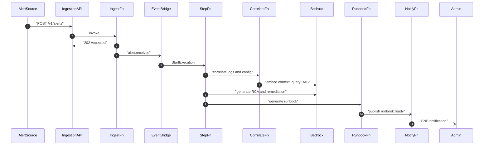
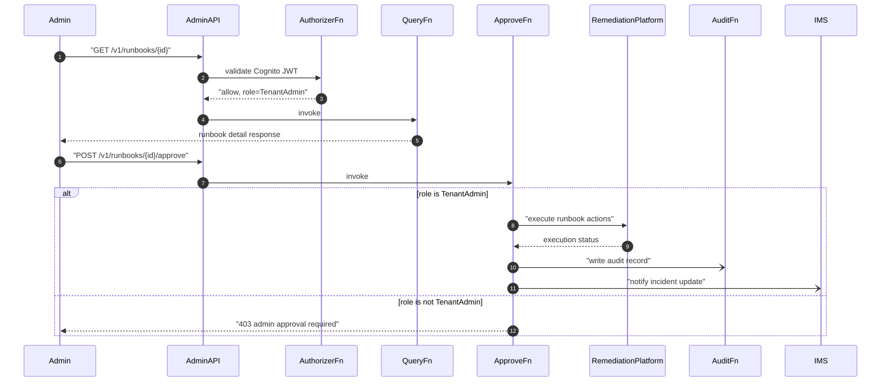

# Solution Design: Automated Technical Outage Diagnosis and Remediation
Data Sensitivity: Internal | Date: 2025-01-16
approved_at: 2025-01-16T18:00:00Z

## Design Overview
Alerts land on a public webhook (API Gateway + HMAC), are normalized by Lambda, and fan out through EventBridge/SQS into a Step Functions pipeline that pulls logs and config/VCS changes via tenant-scoped credentials, embeds context for RAG lookup against S3 Vectors, and calls Bedrock (claude-haiku-4-5) to produce RCA, remediation steps, and a runbook stored in S3/DynamoDB. Tenant users authenticate via Cognito and consume diagnostics/runbooks through a Cognito-authorized admin API; remediation execution against the outbound Remediation Execution Platform is gated behind an explicit Tenant-Admin-only approval action, with every executed action written to an AuditTrail table. Optional outbound notification to a customer's Incident Management System fires alongside approval/execution, using the same per-tenant Secrets Manager credential pattern as inbound integrations.

## Resource Inventory
| Resource | AWS Service | Naming Pattern | Purpose |
|----------|-------------|-----------------|---------|
| Ingestion REST API | API Gateway | `outagediag-{env}-ingestion-api` | Public webhook for inbound alerts (API key/HMAC) |
| Admin REST API | API Gateway | `outagediag-{env}-admin-api` | Tenant-facing diagnostics/runbook/approval API (Cognito authorizer) |
| Lambda: Ingestion Normalizer | AWS Lambda | `outagediag-{env}-fn-ingest-normalize` | Validate/normalize alert payload, write Alerts row, emit event |
| Lambda: Log Correlation | AWS Lambda | `outagediag-{env}-fn-correlate-logs` | Query tenant log platform, cache results in S3 |
| Lambda: Config/VCS Correlation | AWS Lambda | `outagediag-{env}-fn-correlate-config` | Query tenant Git/deployment APIs, cache diffs in S3 |
| Lambda: RAG Context Builder | AWS Lambda | `outagediag-{env}-fn-rag-context` | Embed alert+log+config context (cohere), query S3 Vectors |
| Lambda: RCA & Remediation Generator | AWS Lambda | `outagediag-{env}-fn-generate-rca` | Invoke Bedrock claude-haiku for RCA + remediation steps |
| Lambda: Runbook Generator | AWS Lambda | `outagediag-{env}-fn-generate-runbook` | Render runbook doc, store in S3 + Runbooks table |
| Lambda: Notification Dispatcher | AWS Lambda | `outagediag-{env}-fn-notify` | Publish runbook-ready notifications to SNS |
| Lambda: Admin API Authorizer | AWS Lambda | `outagediag-{env}-fn-authorizer` | Validate Cognito JWT, inject tenant_id/role into context |
| Lambda: Diagnostics/Runbook Query | AWS Lambda | `outagediag-{env}-fn-query-diagnostics` | Backend for GET diagnostics/runbooks endpoints |
| Lambda: Remediation Execution Trigger | AWS Lambda | `outagediag-{env}-fn-trigger-remediation` | Enforce Tenant-Admin approval, call Remediation Execution Platform |
| Lambda: Incident Mgmt Notifier | AWS Lambda | `outagediag-{env}-fn-notify-ims` | Push diagnostic findings/runbook link to Incident Mgmt System |
| Lambda: Audit Writer | AWS Lambda | `outagediag-{env}-fn-audit-write` | Persist executed-action records to AuditTrail |
| Step Functions State Machine | AWS Step Functions | `outagediag-{env}-sfn-diagnosis-pipeline` | Orchestrates correlation → RAG → RCA → runbook stages |
| EventBridge Rule | Amazon EventBridge | `outagediag-{env}-rule-alert-received` | Triggers Step Functions on `alert.received` |
| SQS Queue + DLQ | Amazon SQS | `outagediag-{env}-queue-alert-buffer` / `-dlq` | Buffers alert bursts; DLQ for failed executions |
| SNS Topic: Runbook Ready | Amazon SNS | `outagediag-{env}-topic-runbook-ready` | Notifies tenant admins runbook is available |
| SNS Topic: Ops Alarms | Amazon SNS | `outagediag-{env}-topic-ops-alarms` | Routes CloudWatch SLA alarms to ops |
| S3 Vectors Index | Amazon S3 Vectors | `outagediag-{env}-vectors-incidents` (namespace `tenant/{tenant_id}`) | Similar-incident/runbook retrieval for RAG |
| S3 Bucket: Context Cache | Amazon S3 | `outagediag-{env}-s3-context-cache` (prefix `tenant/{tenant_id}/alert/{alert_id}/`) | Cached logs/config diffs pending correlation |
| S3 Bucket: Runbooks | Amazon S3 | `outagediag-{env}-s3-runbooks` (prefix `tenant/{tenant_id}/runbook/{runbook_id}/`) | Generated runbook documents |
| S3 Bucket: Audit Exports | Amazon S3 | `outagediag-{env}-s3-audit-exports` (prefix `tenant/{tenant_id}/`) | Periodic audit trail exports |
| DynamoDB: Tenants | Amazon DynamoDB | `outagediag-{env}-ddb-tenants` | Tenant registry/config metadata |
| DynamoDB: Alerts | Amazon DynamoDB | `outagediag-{env}-ddb-alerts` | Ingested alert records |
| DynamoDB: Diagnostics | Amazon DynamoDB | `outagediag-{env}-ddb-diagnostics` | RCA/remediation output per alert |
| DynamoDB: Runbooks | Amazon DynamoDB | `outagediag-{env}-ddb-runbooks` | Runbook metadata/status/approval state |
| DynamoDB: AuditTrail | Amazon DynamoDB | `outagediag-{env}-ddb-audit-trail` | Executed remediation action log |
| Cognito User Pool | Amazon Cognito | `outagediag-{env}-cognito-userpool` | Tenant admin/engineer/leadership auth; groups TenantAdmin/TenantEngineer/TenantLeadership |
| Secrets Manager: Integration Creds | AWS Secrets Manager | `outagediag/{env}/tenant/{tenant_id}/integration-creds` | Per-tenant log/VCS/remediation/IMS credentials |
| Secrets Manager: Tenant DEK | AWS Secrets Manager | `outagediag/{env}/tenant/{tenant_id}/dek` | Per-tenant app-layer data encryption key |
| SSM Parameter Store | AWS Systems Manager Parameter Store | `/outagediag/{env}/tenant/{tenant_id}/endpoints`, `/outagediag/{env}/feature-flags/{flag}` | Tenant endpoint configs, feature flags |
| CloudWatch Alarms | Amazon CloudWatch | `outagediag-{env}-alarm-runbook-sla`, `outagediag-{env}-alarm-ingestion-sla` | SLA breach detection (>5min runbook, >1min ingest) |

## Data Model
| Table / Store | Key Schema | Key Attributes | Notes |
|----------------|------------|-----------------|-------|
| Tenants | PK `tenant_id` / SK `PROFILE` | `name`, `status`, `dek_secret_arn`, `created_at` | One profile item per tenant |
| Alerts | PK `tenant_id` / SK `alert#{received_at}#{alert_id}` | `alert_id`, `source`, `severity`, `service`, `status`, `sfn_execution_arn` | Status: received/processing/complete/failed |
| Diagnostics | PK `tenant_id` / SK `diag#{alert_id}` | `alert_id`, `rca_summary`, `remediation_steps`, `rag_context_refs`, `model_version`, `generated_at` | 1:1 with Alerts |
| Runbooks | PK `tenant_id` / SK `runbook#{runbook_id}` | `alert_id`, `diagnostic_id`, `s3_key`, `status`, `approval_status`, `approved_by`, `generated_at` | GSI `status-index` (PK `tenant_id`, SK `status`) for admin listing |
| AuditTrail | PK `tenant_id` / SK `audit#{timestamp}#{actor}` | `action`, `actor`, `runbook_id`, `alert_id`, `result` | Append-only; 6-month TTL attribute |

## API / Interface Contracts
| Endpoint or Interface | Method | Request | Response | Auth |
|------------------------|--------|---------|----------|------|
| `/v1/alerts` (ingestion API) | POST | Alert payload (id, severity, service, timestamp, description) | 202 `{alert_id, status}` | API key + HMAC signature |
| `/v1/diagnostics/{alertId}` (admin API) | GET | Path param `alertId` | RCA + remediation JSON | Cognito JWT (any tenant role) |
| `/v1/runbooks` (admin API) | GET | Query `status` (optional) | List of runbook summaries | Cognito JWT (any tenant role) |
| `/v1/runbooks/{runbookId}` (admin API) | GET | Path param `runbookId` | Runbook detail + presigned S3 URL | Cognito JWT (any tenant role) |
| `/v1/runbooks/{runbookId}/approve` (admin API) | POST | `{approved: true}` | 200 execution status / 403 if not admin | Cognito JWT, group=`TenantAdmin` |
| `/v1/runbooks/{runbookId}/export` (admin API) | GET | Path param `runbookId` | Runbook JSON w/ script/API references | Cognito JWT (any tenant role) |
| Remediation Execution Platform (outbound) | POST | Normalized runbook action payload | Execution status/result | Per-tenant credentials (Secrets Manager) |
| Incident Management System (outbound) | POST | Diagnostic findings + runbook link | Ack | Per-tenant credentials (Secrets Manager) |

## IAM & Access Design
| Principal | Resource | Actions | Justification |
|-----------|----------|---------|----------------|
| `fn-ingest-normalize` role | Alerts table, EventBridge bus, SQS queue | `dynamodb:PutItem` (tenant_id condition), `events:PutEvents`, `sqs:SendMessage` | Normalize and enqueue inbound alerts |
| `fn-correlate-logs` / `fn-correlate-config` roles | Secrets Manager (tenant creds), S3 context-cache bucket | `secretsmanager:GetSecretValue` (tenant-scoped ARN condition), `s3:PutObject` (tenant prefix) | Pull external logs/config using tenant credentials |
| `fn-rag-context` role | S3 Vectors index, Bedrock embed model | `s3vectors:QueryVectors`/`PutVectors` (tenant namespace), `bedrock:InvokeModel` (cohere.embed-multilingual-v3) | RAG retrieval grounding |
| `fn-generate-rca` role | Bedrock generation model, Diagnostics table, S3 context-cache | `bedrock:InvokeModel` (claude-haiku-4-5), `dynamodb:PutItem` (tenant_id condition), `s3:GetObject` (tenant prefix) | Produce RCA/remediation |
| `fn-generate-runbook` role | Bedrock generation model, S3 runbooks bucket, Runbooks table | `bedrock:InvokeModel`, `s3:PutObject` (tenant prefix), `dynamodb:PutItem` (tenant_id condition) | Render and store runbook |
| `fn-notify` / `fn-notify-ims` roles | SNS topics, Secrets Manager (IMS creds) | `sns:Publish`, `secretsmanager:GetSecretValue` | Notify admins / outbound IMS update |
| `fn-authorizer` role | Cognito user pool | `cognito-idp:GetUser` | Validate JWT, extract tenant_id + group claim |
| `fn-query-diagnostics` role | Diagnostics, Runbooks tables | `dynamodb:GetItem`/`Query` (tenant_id condition) | Serve read endpoints |
| `fn-trigger-remediation` role | Runbooks table, Secrets Manager (remediation creds), AuditTrail table | `dynamodb:UpdateItem`, `secretsmanager:GetSecretValue`, `dynamodb:PutItem`; invocation gated on authorizer context `group == TenantAdmin` | Enforces C-03 human-approval, Admin-only per user decision |
| `fn-audit-write` role | AuditTrail table | `dynamodb:PutItem` (tenant_id condition) | Immutable action log |
| Step Functions execution role | All pipeline stage Lambdas | `lambda:InvokeFunction` (scoped to named function ARNs) | Orchestration |
| Cognito group `TenantAdmin` | Admin API `/runbooks/{id}/approve` | Route-level authorization | Only admins may authorize remediation execution |
| Cognito group `TenantEngineer`/`TenantLeadership` | Admin API read routes | Route-level authorization | View-only access to diagnostics/runbooks |

## Sequence Detail

1. External alert source posts to the ingestion webhook.
2. API Gateway invokes the Ingestion Normalizer Lambda synchronously.
3. Lambda writes the Alerts row and returns 202 immediately (meets NFR-02 <1min).
4. Lambda fires `alert.received` to EventBridge (async, fire-and-forget).
5. EventBridge rule starts a Step Functions execution scoped to tenant_id/alert_id.
6. Step Functions invokes log/config correlation Lambdas in parallel.
7. Correlation output is embedded and matched against S3 Vectors for similar past incidents.
8. Step Functions invokes Bedrock (claude-haiku) with alert + correlated context + RAG results to produce RCA/remediation, stored in Diagnostics table.
9. Step Functions invokes the Runbook Generator, which stores the document in S3 and metadata in Runbooks table (must complete within 5-min SLA, NFR-01).
10. Runbook Generator fires notification (async) to the Notification Dispatcher.
11. Notification Dispatcher publishes to SNS, which delivers to tenant admins (and optionally the Incident Management System).

1. Admin retrieves runbook detail via the admin API; the authorizer Lambda validates the Cognito JWT and attaches the tenant_id/role claims.
2. Query Lambda returns runbook detail (status, S3-backed content link) within NFR-06's 2-second target.
3. Admin submits an approval request on the same runbook.
4. Approve Lambda checks the authorizer's role claim: only `TenantAdmin` may proceed (per approved design decision); any other role receives 403.
5. On approval, Approve Lambda calls the tenant's Remediation Execution Platform using credentials from Secrets Manager.
6. Execution result is written asynchronously to the AuditTrail table (actor, timestamp, tenant_id, result).
7. Approve Lambda asynchronously notifies the tenant's Incident Management System with the diagnostic findings/runbook link, if configured.

## Error Handling & Observability
| Concern | Approach |
|---------|----------|
| Retries/idempotency | Alerts table conditional write on `alert_id` dedups re-delivered webhooks; Step Functions retry policy (exponential backoff, max 3 attempts) on transient Lambda/Bedrock errors |
| Failure alerting | CloudWatch Alarms on Step Functions execution failures and SQS DLQ depth publish to `outagediag-{env}-topic-ops-alarms` |
| SLA breach detection | CloudWatch Alarms on runbook-delivery latency (>5min) and ingestion latency (>1min) per BRD NFR-01/NFR-02 |
| Logging | Structured JSON logs per Lambda to CloudWatch Logs, correlated by `tenant_id` + `alert_id` |
| Tracing | AWS X-Ray enabled on all Lambdas and the Step Functions state machine; trace ID propagated through Bedrock invocation spans |
| Bedrock throttling | Lambda-side retry with jittered backoff; persistent failure routes execution to SQS DLQ for manual redrive |
| Remediation execution failures | Captured as `result=failed` in AuditTrail; admin notified via SNS ops topic for manual follow-up |

## Open Engineering Decisions
| ID | Decision | Options | Recommendation |
|----|----------|---------|-----------------|
| OED-01 | Where to enforce "Admin-only" approval | (a) API Gateway resource policy per route, (b) Lambda-side check on Cognito group claim | (b) Lambda-side check — simpler to maintain, avoids duplicated policy logic across environments |
| OED-02 | Per-tenant DEK rotation/re-encryption strategy | (a) Scheduled rotation + eager re-encrypt, (b) Scheduled rotation + lazy re-encrypt on read | (b) Lazy re-encrypt on read every 90 days — lower operational cost, acceptable given Internal sensitivity |
| OED-03 | S3 Vectors namespace retention/cleanup | (a) Manual purge job, (b) TTL-aligned automatic expiry | (b) TTL-aligned to the 6-month retention policy already set for other tenant data |
| OED-04 | Normalizing heterogeneous Remediation Execution Platform APIs across tenants | (a) Tenant-specific Lambda code branches, (b) Normalized internal action schema + per-tenant adapter config in Parameter Store/Secrets Manager | (b) Normalized schema + adapter config — keeps `fn-trigger-remediation` generic and tenant-onboarding config-driven |
